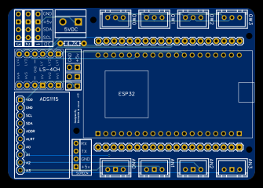

# Présentation du PCB

Le PCB FrangiPool est une carte conçue pour accueillir un module **ESP32** et l'ensemble des périphériques nécessaires à l'automatisation d'une piscine à sel.

## Caractéristiques principales

- **Alimentation** : 5 V (adaptateur secteur externe)
- **Microcontrôleur** : ESP32 (module DevKit standard)
- **Tous les GPIO de l'ESP32** sont accessibles via des connecteurs dupont femelle

## Composants intégrés

### Convertisseur analogique-numérique — ADS1115

L'ADS1115 est un ADC 16 bits sur bus I²C (adresse `0x48`). Il est équipé d'un **convertisseur de niveau pour les entrées 5 V**, permettant de connecter des sondes alimentées en 5 V (Gravity pH Meter v2.0, sonde Redox).

- 4 entrées analogiques disponibles
- Canal A0 : sonde Redox/ORP
- Canal A1 : sonde pH
- Canaux A2, A3 : disponibles

### Bus 1-Wire

Le bus 1-Wire (GPIO23) est câblé avec **4 connecteurs directs** pour les sondes Dallas DS18B20. Tous les connecteurs sont en parallèle — les sondes se partagent le même bus et sont détectées automatiquement par l'ESP.

### Connecteur Nextion

Un connecteur dédié est prévu pour un **écran tactile Nextion**. Ce connecteur n'est pas utilisé par le firmware actuel, mais reste disponible pour des évolutions.

### Connecteurs I²C

Des connecteurs I²C supplémentaires sont disponibles pour brancher d'autres capteurs ou afficheurs compatibles (capteurs de pression, hygromètre, etc.).

## Relais

Les relais sont connectés aux GPIO de l'ESP32 via des **connecteurs dupont** :

| Relais | GPIO | Logique | Usage |
|--------|------|---------|-------|
| Pompe filtration | GPIO25 | Active-LOW | Pompe principale |
| Booster | GPIO26 | Active-LOW | Surpresseur (presets B*) |
| Électrolyseur | GPIO27 | Active-LOW\* | Électrolyseur |

\* L'électrolyseur utilise `RESTORE_DEFAULT_ON` — son état est restauré après redémarrage.

Voir [Mappage des GPIO](./gpio-map) pour le détail de tous les GPIO utilisés.

## Fichiers de fabrication

Les fichiers Gerber sont publiés dans les [releases GitHub PCB](https://github.com/gaetanars/FrangiPool/releases) (tags `pcb-*.*.*`). Voir [Fabrication](./fabrication) pour les instructions de commande.
